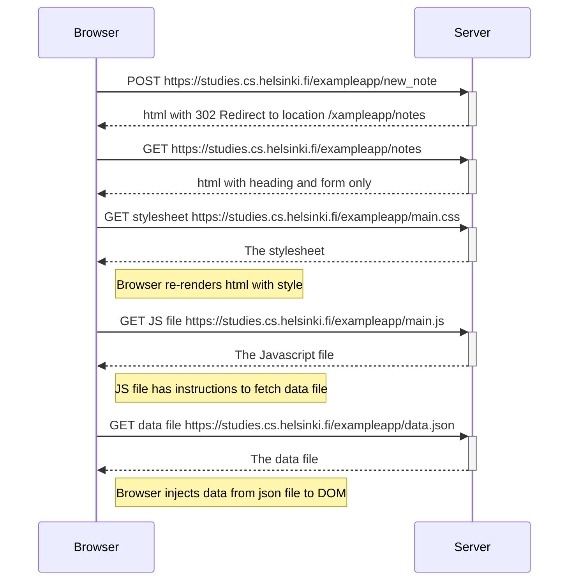

# Sending a Form: an Older Approach

[//]: # ( University of Helsinki                                               )
[//]: # ( Full Stack Open, Excercice 0.4                                       )
[//]: # ( Ville Jorma <vjorma> 2026                                            )

The following diagram shows what happens when a new note is added from
<https://studies.cs.helsinki.fi/exampleapp/notes> by entering a new value to
the input field of the form and clicking Save-button.

