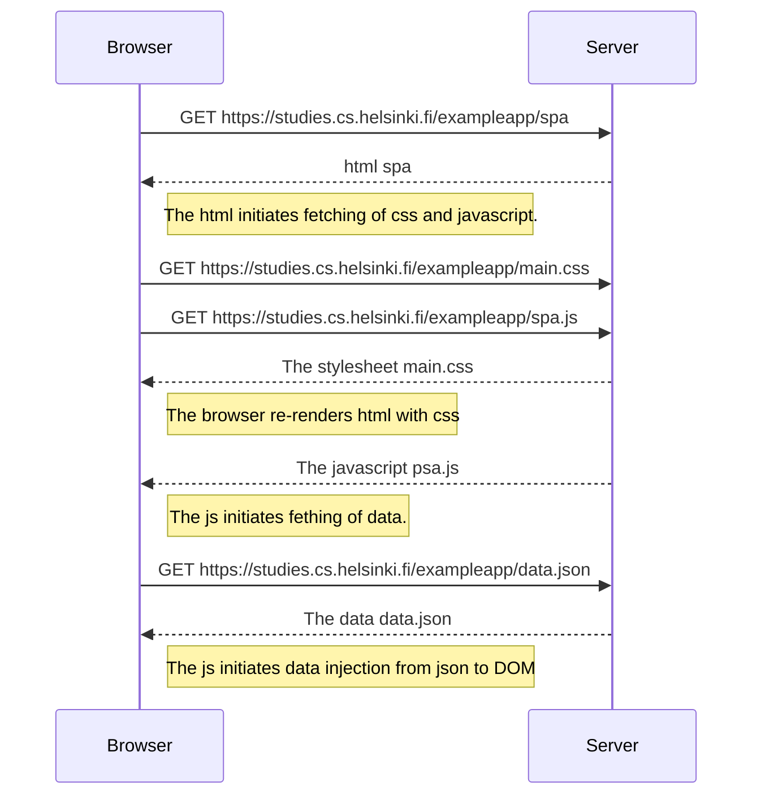

# Loading a Single Page App

[//]: # ( University of Helsinki                                               )
[//]: # ( Full Stack Open, Excercice 0.5                                       )
[//]: # ( Ville Jorma <vjorma> 2026                                            )

The following diagram shows what happens when page
<https://studies.cs.helsinki.fi/exampleapp/spa> is loaded.

